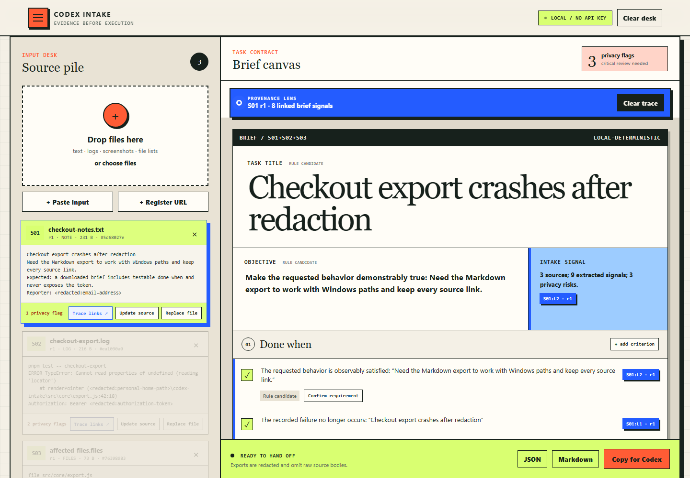
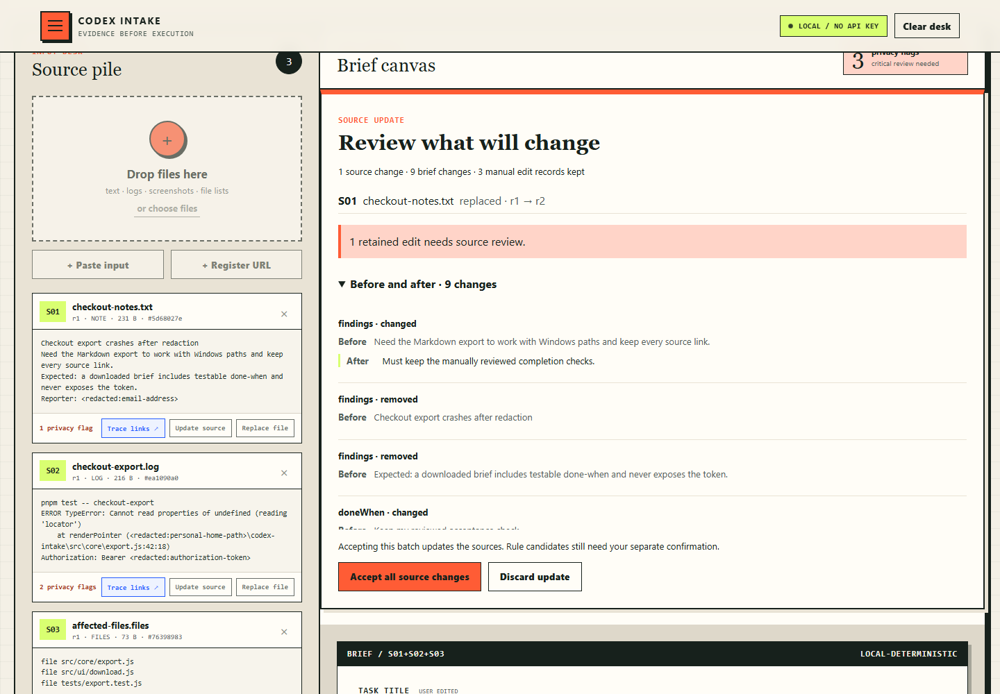

# Codex Intake

**Messy inputs in. Source-linked task brief out.**

Codex Intake is a local-first dropzone for the awkward minute before real work begins. Drop notes, logs, screenshots, or a file inventory; edit the resulting brief; clear privacy flags; then hand Codex a task contract whose claims and completion checks still point back to evidence.



> **Signature interaction — Provenance Lens.** Choose **Trace links** on any real source card—or select a pointer—to illuminate every linked brief signal and dim unrelated material. The lens follows stored pointers; it never invents provenance. See the [Proofing Press design direction](docs/design-system.md).

> v0.2.0-rc.1 preview · review source updates · keep manual edits · no API key · no telemetry

## Sources changed. Keep the work you reviewed.

Add several files, update a pasted source, replace a selected file, remove a source, or rerun local OCR. Intake previews the affected suggestions before changing your accepted brief.



1. Use **Update source**, **Replace file**, or add new material.
2. Review the before/after list. The accepted brief stays unchanged until **Accept all source changes**; **Discard update** leaves it intact.
3. Inspect any **Source changed · review** items. Edited text is kept with its previous source revision instead of silently attaching it to new evidence.
4. **Undo last source update** restores the previous source set and keeps manual edits made afterward.

**Rule candidate**, **Edited candidate**, and **User confirmed** are distinct. Accepting a source batch does not confirm its requirements. For a stale requirement, **Keep as my requirement** records an explicit user decision with its previous reference; it does not assert that the replacement source supports the old wording.

Updates operate within the current page session. The CLI shares the compiler and export format; it is not a persistent draft editor. See [source-update semantics and examples](docs/SOURCE_UPDATES.md).

## The product loop

| Before | After |
| --- | --- |
| Three screenshots, a stack trace, “see this URL,” and an unexplained folder | One editable title and objective |
| Sensitive values hidden in the noise | A severity-ranked privacy review with masked previews |
| “Fix it” as the only acceptance test | Observable, editable done-when candidates |
| Claims detached from their origin | `S02:L4`, `S01:OCR:L7`, and `S03:entry 2` on every extracted item |

The deterministic compiler is deliberately modest: it discovers problem signals, requirement language, commands, paths, URLs, and common privacy risks. It labels these as rule-derived candidates rather than pretending a local regex is understanding the task.

## Try the 20-second demo

Requirements: Node.js 20.19 or newer and pnpm 11.19.0.

Download the source ZIP from [GitHub Releases](https://github.com/codex-improvement-lab/codex-intake/releases), extract it, and open a terminal in the extracted folder. The text/log/inventory CLI works immediately with Node, without dependency installation. The Web UI and screenshot OCR use the installation step below.

```bash
pnpm install
pnpm dev
```

Open `http://127.0.0.1:5173`, choose **Load the 20-second demo**, then choose **Trace links** on a source card. The Provenance Lens reveals every brief signal linked to that source; pointer chips provide the reverse journey back to its card. Edit the title or a done-when and download the redacted Markdown.

The install step downloads pinned JavaScript packages and English/Simplified Chinese Tesseract language data. After installation, parsing and OCR run locally; the app makes no external runtime request.

## Use the CLI

The CLI and browser use the same deterministic compiler.

```bash
# Selected files only
node scripts/intake.mjs examples/incident.log examples/request.txt

# Inventory names without reading file bodies
node scripts/intake.mjs --inventory src --max-depth 2 --format json

# Register a URL without fetching it
node scripts/intake.mjs --url https://example.com/issues/42

# OCR a selected screenshot locally after pnpm install
node scripts/intake.mjs failure.png --ocr --out task-brief.md
```

Run `node scripts/intake.mjs --help` for the complete option list.

## What is supported

| Input | Current behavior | Network behavior |
| --- | --- | --- |
| Text, Markdown, transcript text | Local line-based signal and privacy extraction | None |
| Logs and stack traces | Problem, command, and path candidates | None |
| File inventory | Deterministic entries; directory mode reads names, not bodies | None |
| PNG/JPEG/WebP/BMP/TIFF screenshots | Local English + Simplified Chinese OCR, with OCR confidence recorded | None after install |
| URL | Registers the URL and preserves it as evidence | Never fetched |
| Audio, PDF, office files | Not extracted; provide transcript or text export | None |

Screenshot OCR is evidence extraction, not visual reasoning. A screenshot without OCR stays explicitly marked “not searchable,” and low-quality OCR should be edited before handoff.

## The brief contract

Each source receives a stable desk ID, a revision and a deterministic content fingerprint. Removing S02 does not rename S03; replacing S02 retains that ID and advances its revision. Every extracted finding, privacy warning, open gap, and generated done-when has this pointer shape:

```json
{
  "sourceId": "S02",
  "sourceRevision": 2,
  "locator": "L4",
  "excerpt": "ERROR TypeError: locator is undefined"
}
```

Portable JSON schema 1.1 and Markdown exports contain source metadata, revision pointers, review/confirmation states and masked excerpts, never raw source bodies. User-authored criteria use `USER:manual`. Edited fields remain user-owned. When their source changes or disappears, the text and previous reference are retained and clearly marked for review; untouched suggestions refresh from the compiler. Historical source metadata is included only when a preserved edit references it.

The compiler is deterministic for identical ordered inputs: there is no timestamp, random ID, API call, or model sampling in the result.

## Privacy posture

- Files are read only after explicit browser selection or an explicit CLI path.
- URL inputs are registered but not fetched.
- Browser drafts are held in the current page session and are not silently persisted.
- The local OCR endpoint binds through the Vite localhost server and accepts only a bounded image payload.
- Exported Markdown and JSON redact detected values and omit raw source bodies.
- Detection is best-effort. “No flags” is not a guarantee that material is safe to share.

See [SECURITY.md](SECURITY.md) for the threat model and reporting path.

## Codex integration

This repository is also a valid skill-only Codex plugin. Its manifest is at [`.codex-plugin/plugin.json`](.codex-plugin/plugin.json), and the workflow is in [`skills/codex-intake/SKILL.md`](skills/codex-intake/SKILL.md).

The plugin does not claim an MCP server, hook, or native composer integration. The local Web UI owns raw-file intake; the skill routes Codex to the CLI or the reviewed export. That division follows the current official extension boundaries documented in [EXTENSION_SURFACE.md](docs/EXTENSION_SURFACE.md).

For local authoring, the repository includes an official-shape repo marketplace at [`.agents/plugins/marketplace.json`](.agents/plugins/marketplace.json). Prepare and validate its generated install copy before adding the repository as a non-default marketplace:

```bash
pnpm marketplace:prepare
pnpm marketplace:check
codex plugin marketplace add "/absolute/path/to/codex-intake"
codex plugin add codex-intake@codex-intake-local
```

Start a **new Codex task or CLI session** after installation so bundled skills are loaded. The generated `plugins/codex-intake` package and Codex cache are development artifacts, not source of truth. See [MACOS_HANDOFF.md](docs/MACOS_HANDOFF.md) for install, fresh-task, installed-copy, status, and uninstall acceptance steps.

Release candidates are identified by both the cache-busted plugin version and `release/REPLACEMENT_CANDIDATE.json` content SHA-256. Installed-copy validation resolves the cache leaf dynamically; it does not assume that a local marketplace uses a literal `local` directory.

## Architecture

```text
explicitly selected input
        │
        ├── browser dropzone ── local OCR (optional)
        │
        └── CLI / directory inventory
                    │
             deterministic core
          ┌─────────┼──────────┐
       findings  privacy     gaps
          └─────────┼──────────┘
              editable brief
                    │
        redacted Markdown / JSON / Codex prompt
```

Read [ARCHITECTURE.md](docs/ARCHITECTURE.md) for data boundaries and [PRODUCT_INSIGHTS.md](docs/PRODUCT_INSIGHTS.md) for the product reasoning.

## Quality and evidence

```bash
pnpm test          # deterministic core, privacy, and CLI
pnpm build         # production Web bundle
pnpm test:e2e      # Chromium interaction, download, real local OCR, screenshot
pnpm marketplace:check # generate + validate the repo-local plugin package
pnpm test:e2e:mac-handoff # exact edit-before-upload/OCR replacement regression
pnpm check:macos-design # static dual-architecture audit; never Mac evidence
pnpm release:check # repository gate + all checks above
```

Evidence labels are intentionally strict:

- **Windows automated:** local Node, build, unit tests, headless Chromium, and OCR run in this repository.
- **Historical macOS acceptance:** the exact 2026-08-30 replacement candidate has a bound external automated functional PASS. Hardware, architecture and OS versions were not repeated in that final report. Current release metadata and later source-update changes have separate checks; see [platform scope](docs/PLATFORM_SUPPORT.md).
- **Real user:** no claim yet.

The exact latest run is recorded in [TEST_EVIDENCE.md](docs/TEST_EVIDENCE.md). CI configuration is not presented as direct device evidence.

## Project status

The [v0.1.0 baseline](https://github.com/codex-improvement-lab/codex-intake/releases/tag/v0.1.0) was released first. v0.2.0-rc.1 adds source-update review from a separate development branch. Source ZIPs and verification results are available through [GitHub Releases](https://github.com/codex-improvement-lab/codex-intake/releases). npm and plugin-directory submission are separate.

## Contributing

Focused fixes are welcome. Start with [CONTRIBUTING.md](CONTRIBUTING.md), especially the provenance and privacy invariants. The project is MIT licensed; see [LICENSE](LICENSE).
