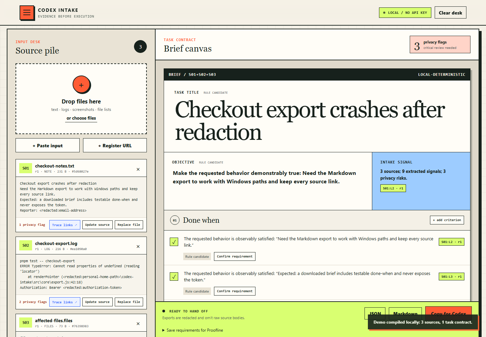
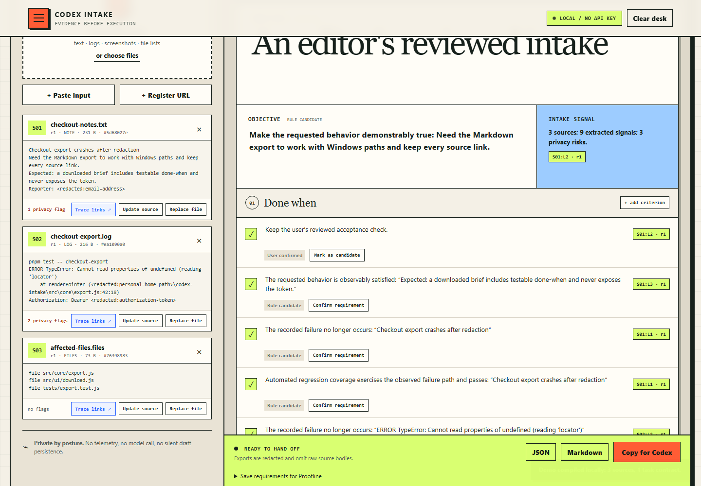
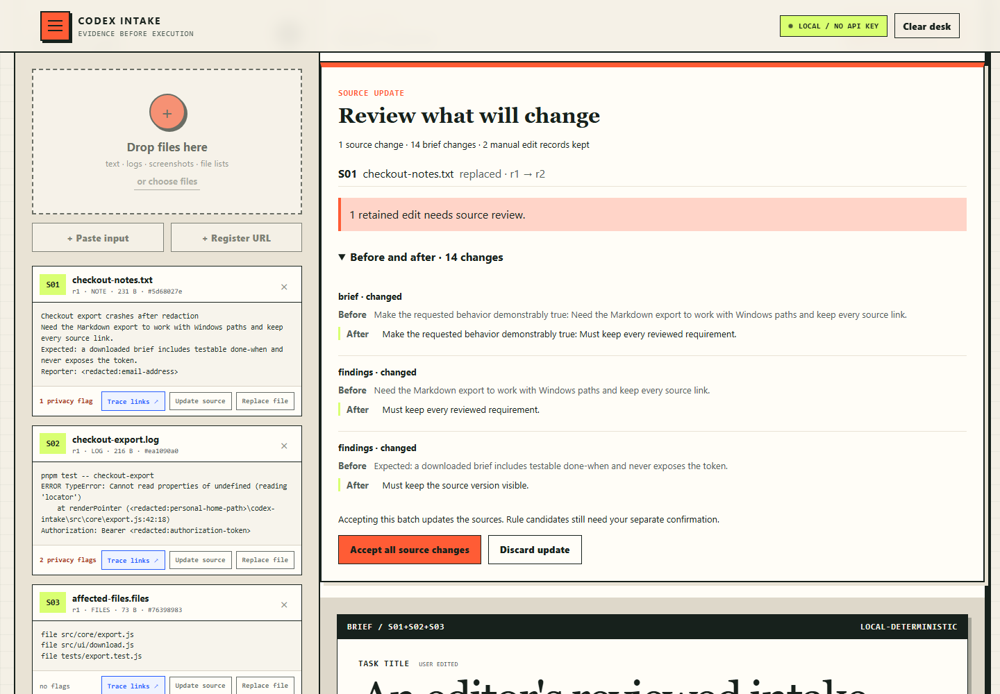
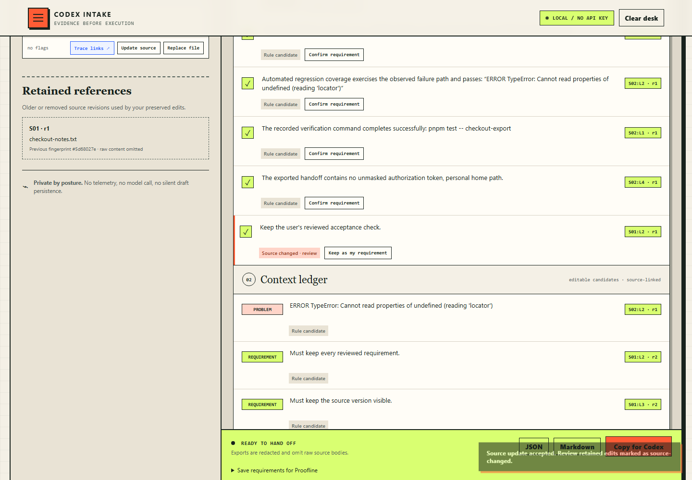
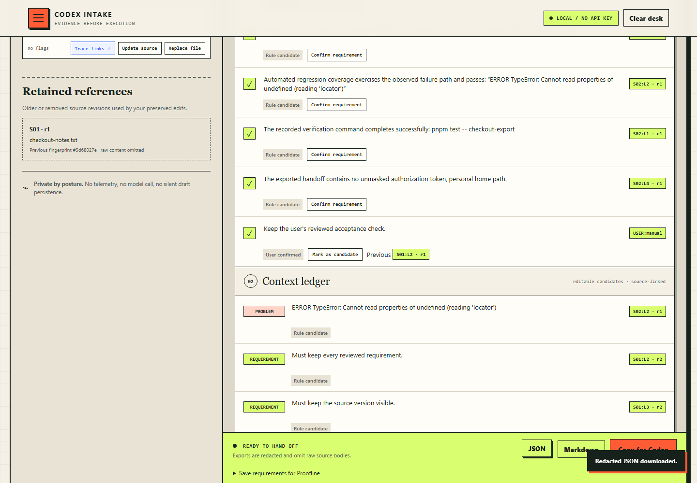

# Keep your review when a source changes

This walkthrough uses Intake's built-in demo. You will edit and confirm a requirement, replace its source, review what changed, and save the result. The screenshots show authored example data in the current source UI.

Start the [local UI](../README.md#try-the-20-second-demo). The desk lasts for the current browser session, so download your result before closing the page.

## 1. Load the demo

Select **Load the 20-second demo**. Three source cards appear on the left and a draft brief appears on the right. The draft's candidates still need your review.



## 2. Confirm your own wording

Set the task title to `An editor's reviewed intake`. In **Done when**, change the first acceptance check to `Keep the user's reviewed acceptance check.` and select its **Confirm requirement** button.



## 3. Replace the source and inspect the preview

On source **S01**, select **Update source**. Replace its text with:

```text
Revised export request
Must keep every reviewed requirement.
Must keep the source version visible.
```

Select **Review source replacement**. Check the r1 → r2 change, the before/after suggestions, and the notice that a retained edit needs review. Select **Accept all source changes** when you are ready to apply the batch.



## 4. Decide whether to keep the edited requirement

Find your wording in **Done when**, marked **Source changed · review**. Intake has kept the text and its old source reference. If it still expresses your intent, select **Keep as my requirement**.

This records your explicit decision. It does not claim that the new source supports the old wording.



## 5. Download the reviewed brief

Select **JSON** in the export bar. Your downloaded brief contains the reviewed title, S01 at revision 2, and the retained requirement marked `user-authored` and `user-confirmed`.



[View the JSON exported from this example](examples/reviewed-source-update.json). To keep a requirements-only file for later CLI review or Proofline, use the separate [requirement snapshot workflow](REQUIREMENT_SNAPSHOTS.md).

The example was executed on Windows against [source commit 94f77bf](https://github.com/codex-improvement-lab/codex-intake/commit/94f77bf57d24ed5223f37ebe86539b858fcfadae). It is a demonstration of the workflow, not an independent usability study.
